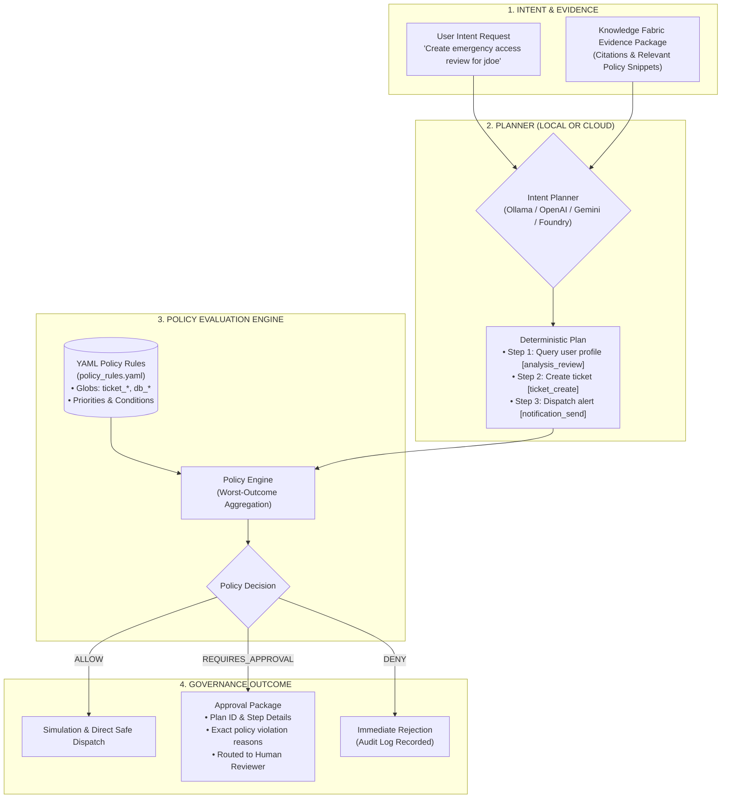

<p align="center">
  
</p>

# Intent Fabric

<p align="center">
  <strong>Vendor-neutral, policy-governed agent planning and approval framework.</strong><br>
  Deterministic Action Contracts &bull; YAML Policy Engine &bull; Human-in-the-Loop Approval Packages &bull; MCP-Native
</p>

<p align="center">
  <a href="https://github.com/sagarv48/intent-fabric/actions"></a>
  <a href="LICENSE"></a>
  <a href="https://www.python.org/downloads/"></a>
  <a href="https://modelcontextprotocol.io"></a>
  <a href="BRANDING.md"></a>
</p>

---

## Why Intent Fabric?

Most autonomous AI agent architectures jump directly from a user prompt to executing API calls and modifying production state. In enterprise, healthcare, and finance, this is an unacceptable operational and security risk.

| Risky Traditional AI Agents | Intent Fabric Governance Architecture |
| :--- | :--- |
| **Black-Box Execution**: The LLM calls external APIs with zero intermediate policy inspection. | **Deterministic Action Contracts**: Every proposed action is converted into an explicit, auditable `PlanStep` before anything can execute. |
| **Hardcoded Guardrails**: Safety rules are embedded in brittle prompts or hidden inside Python code. | **YAML-Driven Policy Engine**: Extensible policy rules with glob patterns, priorities, and runtime hot-reloading. Zero code changes to update policies. |
| **No Approval State**: If an action is risky, the entire agent run crashes or blindly proceeds. | **Structured Approval Packages**: Generates structured, tamper-evident approval requests (`requires_approval`) routed to human reviewers in Slack, Jira, or ServiceNow. |
| **Hallucinated Actions**: Agents invent arbitrary parameters without grounding in verified documents. | **Evidence-Grounded Planning**: Planners ingest verified `EvidencePackage` objects from [Knowledge Fabric](https://github.com/sagarv48/knowledge-fabric) to ground every step in cited truth. |
| **Vendor Lock-In**: Frameworks tie your planning and agent loops to proprietary cloud APIs. | **Local & Multi-Cloud Planner Support**: Defaults to Ollama for free, private, local planning. OpenAI, Gemini, and Azure AI Foundry are equal, drop-in alternatives. |

---

## Architecture



---

## Quickstart

### 1. Install
```bash
git clone https://github.com/sagarv48/intent-fabric.git
cd intent-fabric

# Install package
python3 -m pip install -e .

# Or with dev dependencies
python3 -m pip install -e ".[dev]"
```

### 2. Configure Planner
Select your preferred planner via environment variable:
```bash
# Recommended: Local, private, free with Ollama
export INTENT_PLANNER=ollama
ollama pull llama3

# Or cloud options:
# export INTENT_PLANNER=openai; export OPENAI_API_KEY=sk-...
# export INTENT_PLANNER=gemini; export GEMINI_API_KEY=...
```

### 3. Python Usage Example
```python
from intent_fabric.mcp import IntentFabricMCPTools

tools = IntentFabricMCPTools()

# 1. Create a structured plan grounded in evidence
plan = tools.create_plan_from_evidence(
    intent_request={
        "intent_id": "intent_001",
        "user_request": "Create an emergency access ticket and notify the SOC team",
        "requested_actions": ["ticket_create", "notification_send"],
    },
    evidence_package={
        "query_text": "emergency access procedure",
        "items": [
            {
                "chunk_id": 101,
                "document_uri": "policy://access_control.md",
                "snippet": "Break-glass requires an audit ticket within 1 hour.",
                "score": 0.89,
            }
        ],
    },
)

# 2. Validate against active YAML policy rules
decision = tools.validate_plan(plan)
print(f"Decision: {decision.decision_type.name}")  # REQUIRES_APPROVAL

# 3. Create approval package for human review
if decision.decision_type.name == "REQUIRES_APPROVAL":
    approval = tools.create_approval_package(plan, decision, requested_by="analyst")
    print(f"Approval ID: {approval.approval_id}")
    print(f"Reasons: {approval.reasons}")
```

---

## YAML Policy Rules Configuration

Policies are defined declaratively in `config/policy_rules.yaml`. You can customize rules without touching any code:

```yaml
rules:
  # Deny all destructive operations immediately
  - action_pattern: "db_drop"
    decision: "deny"
    reason: "Destructive database operations are never permitted."
    priority: 100

  - action_pattern: "external_write"
    decision: "deny"
    reason: "Direct external write outside adapter sandbox is prohibited."
    priority: 100

  # Require human approval for external communications and ticket creation
  - action_pattern: "ticket_*"
    decision: "requires_approval"
    reason: "Ticket creation requires human review before execution."
    priority: 50

  - action_pattern: "notification_send"
    decision: "requires_approval"
    reason: "User notifications require human review."
    priority: 50

  # Safe read-only analysis is pre-approved
  - action_pattern: "analysis_*"
    decision: "allow"
    reason: "Read-only analysis actions are pre-approved."
    priority: 10

default_decision: "requires_approval"
```

### Hot Reloading
Set `INTENT_POLICY_RULES=/path/to/policy_rules.yaml`. The engine monitors file modification timestamps (`mtime`) and hot-reloads rule changes on the fly with zero process downtime.

---

## Visual Governance & Review Console

Review pending approval packages and test policy rules interactively using the web management console:

```bash
# Starts the governance console at http://localhost:8080/
knowledge-fabric-ui --port 8080
```

- **Approval Queue**: View pending agent actions, ground-truth evidence citations, and authorize or reject actions with audit comments.
- **Policy Sandbox**: Test arbitrary action strings (e.g., `db_drop_table`, `ticket_create`) against active YAML rules with instant evaluation.

---

## Model Context Protocol (MCP) Tools

Intent Fabric exposes planning and governance tools conforming to the MCP standard:

| Tool Name | Parameters | Description |
| :--- | :--- | :--- |
| `create_plan_from_evidence` | `intent_request` (dict), `evidence_package` (dict) | Generates a structured multi-step plan grounded in provided evidence. |
| `validate_plan` | `plan` (dict) | Evaluates a plan against the active policy rules and returns a decision (`allow`, `deny`, `requires_approval`). |
| `create_approval_package` | `plan` (dict), `decision` (dict), `requested_by` (str) | Constructs an audit-ready approval payload for routing to human approvers. |
| `simulate_plan` | `plan` (dict), `decision` (dict) | Simulates plan execution with zero external side effects and records simulated traces. |

---

## End-to-End Stack Integration

Intent Fabric is designed to sit between **Knowledge Fabric** (evidence retrieval) and **Enterprise Adapters** (runtime action execution):

1. **[Knowledge Fabric](https://github.com/sagarv48/knowledge-fabric)**: Ingests documents, indexes with pgvector, and returns ranked evidence.
2. **Intent Fabric** *(this repository)*: Turns intent + evidence into safe, policy-validated action plans.
3. **Enterprise Adapters**: Executes approved action contracts against Jira, ServiceNow, Slack, or GitHub.

See the complete runnable walkthrough in [`examples/04-end-to-end-with-intent`](https://github.com/sagarv48/knowledge-fabric/tree/main/examples/04-end-to-end-with-intent).

---

## Contributing

Contributions are welcome! Please see [CONTRIBUTING.md](CONTRIBUTING.md) for testing guidelines and development setup.

## Security

See [SECURITY.md](SECURITY.md) for vulnerability reporting guidelines.

## License

Licensed under the [Apache License, Version 2.0](LICENSE).
