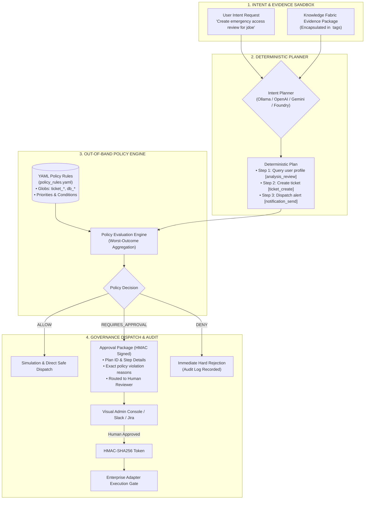

<p align="center">
  
</p>

# Intent Fabric

<p align="center">
  <strong>Vendor-neutral, policy-governed agent planning and approval framework.</strong><br>
  Deterministic Action Contracts &bull; Declarative YAML Policy Engine &bull; Cryptographic HMAC Approvals &bull; Indirect Injection Defense &bull; MCP-Native
</p>

<p align="center">
  <a href="https://github.com/sagarv48/intent-fabric/actions"></a>
  <a href="LICENSE"></a>
  <a href="https://www.python.org/downloads/"></a>
  <a href="https://modelcontextprotocol.io"></a>
  <a href="BRANDING.md"></a>
</p>

---

## The Autonomous Agent Fear Factor: Why CTOs Block AI Deployment

Enterprise engineering and security leaders want the productivity of autonomous AI agents, but they cannot accept the catastrophic risk of unconstrained execution. If an AI agent hallucinates an unauthorized refund, deletes a database table, or leaks confidential customer records, the enterprise bears full legal and financial liability.

| Unconstrained Autonomous Agents | Intent Fabric Governance Architecture |
| :--- | :--- |
| **Black-Box API Execution**: The LLM calls external tools and APIs with zero intermediate policy inspection or schema enforcement. | **Deterministic Action Contracts**: Every proposed action is converted into an explicit, auditable `PlanStep` with strict parameter typing before anything can execute. |
| **Brittle Prompt Guardrails**: Safety rules are embedded in natural language system prompts (*"Please do not delete data"*), easily bypassed by jailbreaks. | **Out-of-Band YAML Policy Engine**: Hard deterministic evaluation rules with glob patterns, priority weighting, and hot-reloading that evaluate actions independently of the LLM. |
| **Binary All-or-Nothing Execution**: If an action is risky, the entire agent run crashes or blindly proceeds without oversight. | **Human-in-the-Loop Approval Packages**: Generates structured, tamper-evident approval requests (`requires_approval`) routed to human reviewers in Slack, Jira, or the Visual Admin Console. |
| **Vulnerable to Indirect Prompt Injection**: Adversarial text hidden inside retrieved documents hijacks the agent's planning logic. | **XML Evidence Sandboxing**: Strict evidence boundaries (`<retrieved_evidence>`) isolate untrusted data from instructions, backed by syntax sanitization (`^[a-zA-Z0-9_.:-]{1,128}$`). |
| **Non-Repudiation Failure**: No cryptographic proof of who authorized a production state mutation. | **HMAC-SHA256 Cryptographic Tokens**: Every human approval decision generates a signed, tamper-evident cryptographic token verified by execution adapters. |
| **Vendor Lock-In**: Frameworks tie planning loops to proprietary cloud APIs. | **Local & Multi-Cloud Planner Support**: Runs locally and privately with Ollama (Llama 3, Mistral), with drop-in support for OpenAI, Gemini, and Azure AI Foundry. |

---

## Architecture: Defense-in-Depth Governance



---

## Industry Governance Blueprints

### 1. Financial Services & Banking
* **Scenario**: Automated AML (Anti-Money Laundering) transaction review and account holds.
* **Governance Rule**: Analysis and pattern matching (`analysis_aml_*`) are pre-approved (`allow`). Any fund freeze or account restriction (`account_hold_*`) automatically triggers `REQUIRES_APPROVAL` routed to the Compliance Officer with cited transaction evidence.

### 2. Healthcare & Clinical Operations
* **Scenario**: Clinical workflow triage and medication order validation.
* **Governance Rule**: Medical protocol retrieval is pre-approved. Any order dispatched to the pharmacy EHR (`ehr_rx_order`) requires an attending physician's cryptographic HMAC sign-off.

### 3. Cloud Infrastructure & DevOps
* **Scenario**: Automated SRE alert remediation on Kubernetes clusters.
* **Governance Rule**: Read-only log inspection (`k8s_get_*`, `k8s_describe_*`) executes autonomously. Mutative actions (`k8s_restart_*`, `helm_rollback`) require senior on-call approval. Destructive actions (`k8s_delete_namespace`, `db_drop_*`) are blocked immediately (`deny`).

---

## Cryptographic Non-Repudiation (HMAC-SHA256)

When an action requires human review, Intent Fabric generates a structured `ApprovalPackage`. Once approved by an authorized reviewer, an HMAC-SHA256 signature is generated:

```json
{
  "approval_id": "appr_87f2e1a9",
  "plan_id": "plan_98234",
  "action": "ticket_create",
  "decision": "Approved",
  "reviewer": "secops-lead@company.com",
  "comment": "Verified emergency request against change ticket CHG-4091",
  "timestamp": 1725624000,
  "algorithm": "HMAC-SHA256",
  "signature": "3b7f8c92a1e4d560718294a5c6d7e8f90123456789abcdef0123456789abcdef"
}
```

Downstream enterprise execution adapters verify this cryptographic token before committing any mutative state changes, guaranteeing full auditability and non-repudiation for SOC 2 Type II compliance.

---

## Quickstart

### 1. Install via PyPI
```bash
pip install intent-fabric
```

### 2. Select Planning Backend
Choose between local, zero-cost inference or enterprise cloud providers:
```bash
# Option A: 100% Local & Private (Recommended)
export INTENT_PLANNER=ollama
ollama pull llama3

# Option B: Enterprise Cloud APIs
# export INTENT_PLANNER=openai; export OPENAI_API_KEY=sk-...
# export INTENT_PLANNER=gemini; export GEMINI_API_KEY=...
# export INTENT_PLANNER=foundry; export FOUNDRY_BASE_URL=http://127.0.0.1:61633
```

### 3. Python Usage Example
```python
from intent_fabric.mcp import IntentFabricMCPTools

tools = IntentFabricMCPTools()

# 1. Generate an evidence-grounded plan
plan = tools.create_plan_from_evidence(
    intent_request={
        "intent_id": "intent_001",
        "user_request": "Investigate cluster alert and restart unhealthy pods",
        "requested_actions": ["k8s_get_pods", "k8s_restart_pod"],
    },
    evidence_package={
        "query_text": "runbook for pod crashloop",
        "items": [
            {
                "chunk_id": 101,
                "document_uri": "runbooks://k8s-triage.md",
                "snippet": "If pod status is CrashLoopBackOff for >15m, restart deployment and notify SRE.",
                "score": 0.94,
            }
        ],
    },
)

# 2. Evaluate against declarative YAML policy rules
decision = tools.validate_plan(plan)
print(f"Policy Decision: {decision.decision_type.name}")
# Output: REQUIRES_APPROVAL

# 3. Create approval package for human review
if decision.decision_type.name == "REQUIRES_APPROVAL":
    approval = tools.create_approval_package(plan, decision, requested_by="oncall-agent")
    print(f"Approval ID: {approval.approval_id}")
    print(f"Policy Justification: {approval.reasons}")
```

---

## Declarative YAML Policy Rules

Policies live in `config/policy_rules.yaml` and support live hot-reloading without process restarts:

```yaml
rules:
  # Hard Deny: Destructive database and infrastructure mutations
  - action_pattern: "db_drop*"
    decision: "deny"
    reason: "Destructive database operations are strictly prohibited."
    priority: 100

  - action_pattern: "k8s_delete_*"
    decision: "deny"
    reason: "Namespace or cluster deletion is strictly prohibited."
    priority: 100

  # Require Human Approval: Write and external communication actions
  - action_pattern: "ticket_*"
    decision: "requires_approval"
    reason: "External ticket modifications require human review."
    priority: 50

  - action_pattern: "k8s_restart_*"
    decision: "requires_approval"
    reason: "Production pod restarts require on-call authorization."
    priority: 50

  # Pre-Approved: Safe read-only inspection
  - action_pattern: "analysis_*"
    decision: "allow"
    reason: "Read-only inspection and diagnosis are pre-approved."
    priority: 10

default_decision: "requires_approval"
```

---

## Model Context Protocol (MCP) Tools

Intent Fabric exposes planning and governance tools conforming to the open MCP specification:

| Tool Name | Parameters | Description |
| :--- | :--- | :--- |
| `create_plan_from_evidence` | `intent_request` (dict), `evidence_package` (dict) | Generates a structured multi-step plan grounded in provided evidence citations. |
| `validate_plan` | `plan` (dict) | Evaluates all plan steps against active policy rules and returns a consolidated decision. |
| `create_approval_package` | `plan` (dict), `decision` (dict), `requested_by` (str) | Assembles a tamper-evident approval payload for human sign-off. |
| `simulate_plan` | `plan` (dict), `decision` (dict) | Simulates plan execution with zero external side effects and records state traces. |

---

## End-to-End Stack Integration

Intent Fabric sits at the center of the enterprise agent architecture:
1. **[Knowledge Fabric](https://github.com/sagarv48/knowledge-fabric)**: Supplies verified ground-truth evidence packages.
2. **Intent Fabric** *(this repository)*: Converts intent + evidence into deterministic, policy-checked action plans.
3. **[Enterprise Adapters](https://github.com/sagarv48/knowledge-fabric-enterprise-adapters)**: Validates HMAC signatures and executes authorized actions against Jira, ServiceNow, Slack, or GitHub.

---

## License

Licensed under the [Apache License, Version 2.0](LICENSE).
